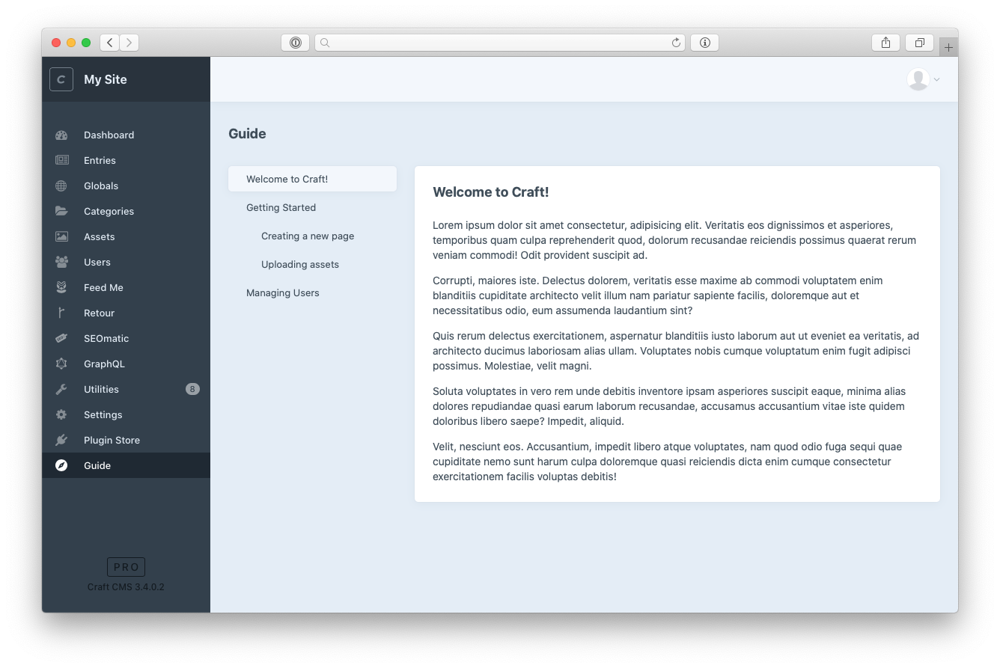

#  Guide
A Craft CMS module to display a help guide in the control panel



## Requirements
Guide is built to run on Craft CMS 3.2 and later

## Installation
1. [Download a zip archive](https://github.com/trendyminds/guide/archive/master.zip), rename the `src` folder to `guide` and add it to your `modules/` folder.
2. Add the contents of the `app.php` file to your `config/app.php` (or just copy it there if it does not exist)
```php
return [
    'modules' => [
        'guide' => [
            'class' => \modules\guide\Guide::class
        ],
    ],
    'bootstrap' => ['guide'],
];
```
3. Add the following to your project's `composer.json` file so that Composer can find your module:
```json
"autoload": {
  "psr-4": {
    "modules\\guide\\": "modules/guide/"
  }
},
```

4. Run the following in your command line
```sh
composer dump-autoload
```

## Configuration

You may configure both the name of the plugin as well as which content type to use as your "Guide" entries in `src/config/guide.php`.

**NOTE**: The section you use must have public URLs disabled. If these are enabled the Guide will not pull this data in and will display an error.
